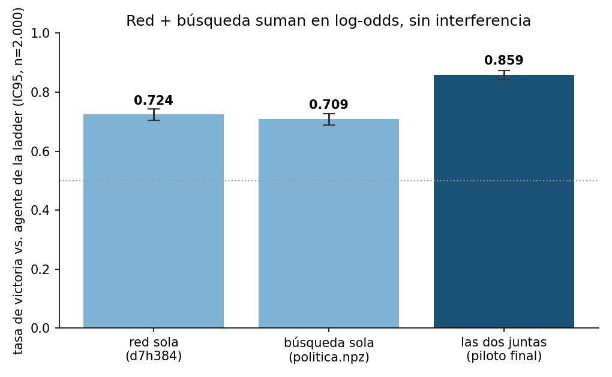

# Pokémon TCG AI Battle Challenge — agente de simulación

Competición Kaggle de The Pokémon Company: dos convocatorias ligadas — **Simulation**
(`pokemon-tcg-ai-battle`, agente que juega, sin premio, da medallas Knowledge) y
**Strategy** (`pokemon-tcg-ai-battle-challenge-strategy`, writeup ≤2.000 palabras,
8 × 30.000 USD + torneo en Tokio). Para optar al premio hay que competir en las dos
con el mismo equipo. Este repo cubre la Simulation, ya cerrada; la Strategy sigue
abierta (cierre 2026-09-13) y su writeup no se publica aquí hasta la entrega.

## Resultado

**Puesto 1.328 de 6.807 (top 20 %).** Score **690,7** con la lista `c1-grimmsnarl` y **643,3**
con `c2-alakazam` — dos mazos distintos pilotados por el mismo agente, elegidos por
criterios distintos (uno maximiza la media, el otro el suelo: nunca por debajo de
0,50 en ninguno de los 12 arquetipos del campo).

## El candidato que se quedó fuera — y la lección de proceso

El agente medido como mejor (`30d+RC`: corpus de 30 días + búsqueda `R_PASOS=32,
N_CAND=5`) ganaba el **74,6% [72,4%, 76,7%]** de las partidas contra el agente de la
ladder — por encima del que finalmente se envió. Terminó de medirse el 14-ago a las
19:35, **15 minutos después** de que acabara el turno de la sesión que lo lanzó. El
recordatorio automático que debía avisar de subirlo no ejecuta nada por sí mismo, y
no había ninguna tarea programada que empaquetara y subiera sin intervención humana:
el corte de envíos pasó con el agente del 12-ago. Postmortem completo en
[`reports/2026-08-17-cierre-simulation-envio-no-realizado.md`](reports/2026-08-17-cierre-simulation-envio-no-realizado.md).

**Lección que se lleva a la siguiente competición:** un compromiso con plazo en
ausencia de supervisión humana solo es real si dispara una tarea programada — un
aviso en segundo plano informa, no ejecuta.

## Arquitectura del agente

El motor de batalla (`cabt`, PyPI vía `kaggle-environments`) se sondea con
[`arena.py`](arena.py) (harness de medición: mismos asientos intercambiados,
intervalos de confianza, paralelización por procesos — con hilos el motor revienta
el proceso con SIGSEGV) y [`gauntlet.py`](research/gauntlet.py) (contra los 12
arquetipos del campo).

Se probaron y compararon con IC95 tres familias de piloto — heurístico manual
(`research/agentes/`), MCTS y clonado de política por imitación
(`research/clon/`) — antes de fijar el envío final:

1. **Clon de política** (`research/agentes/clon.py`) entrenado sobre partidas
   propias con `research/clon/entrenar3.py`/`extraer.py`/`rasgos.py`.
2. **Búsqueda encima del clon** (`research/agentes/clon_busq.py`): rollout guiado
   por la red entrenada. Medido: red sola 0,724, búsqueda sola 0,709, **las dos
   juntas 0,859** — los dos ejes suman en log-odds (predicho 0,865, observado
   0,859), sin interferencia. Es el piloto final, con la red
   `politica_7d_h384_mejorval.npz` (no versionada — se regenera entrenando).

   
3. **Selección de mazo** (`research/decks/`): `c1-grimmsnarl.csv` y
   `c2-alakazam.csv`, las dos listas finalmente enviadas.

Decisiones con números en [`DECISIONS.md`](DECISIONS.md) (18 tickets, cada uno con
lo medido y lo descartado); tickets de trabajo en [`TASKS.md`](TASKS.md).

## Limitaciones

- `RC` (la palanca de búsqueda que dio el 74,6%) nunca se validó a tiempo sobre
  `c1-grimmsnarl` — todo el barrido se hizo en `c2-alakazam`; quedó sin comprobar
  si generalizaba a la otra lista.
- El presupuesto de tiempo por partida llegó a **595,6 s contra un banco de 600 s**
  en la medición del candidato descartado — margen cero, cifras infladas por
  contención y swap, sin la prueba de banco reducido que lo habría discriminado.
- La Strategy (la mitad que reparte premio) sigue abierta: el writeup no forma
  parte de este repo hasta que se entregue.

## Reproducir

```bash
uv venv .venv --python 3.12
uv pip install --python .venv/bin/python -r requirements.txt
```

El motor viene en `kaggle-environments` desde PyPI — no hace falta haber aceptado
las reglas de la competición para usarlo.

```bash
kaggle competitions download -c pokemon-tcg-ai-battle-challenge-strategy -p data/raw
.venv/bin/python arena.py            # medir un agente contra otro, IC95
.venv/bin/python research/gauntlet.py  # un agente contra los 12 arquetipos del campo
```

Los datos de cartas de la competición no se versionan aquí (licencia de Pokémon:
revocable, uso limitado a la competición, obligación de borrarlos al terminar).
