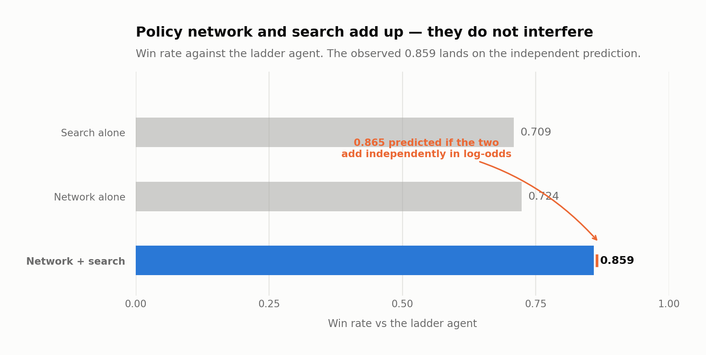

# Pokémon TCG AI Battle Challenge — simulation agent

Kaggle competition run by The Pokémon Company, in two linked calls: **Simulation**
(`pokemon-tcg-ai-battle`, an agent that plays, no prize money, awards Knowledge medals) and
**Strategy** (`pokemon-tcg-ai-battle-challenge-strategy`, a write-up of ≤2,000 words,
8 × $30,000 plus a tournament in Tokyo). To be eligible for the prize you must enter both with
the same team. This repository covers the Simulation half, now closed; the Strategy write-up is
not published here.

## Result

**1,328th of 6,807 (top 20%).** Score **690.7** with the `c1-grimmsnarl` list and **643.3** with
`c2-alakazam` — two different decks piloted by the same agent, chosen by different criteria (one
maximises the mean, the other the floor: never below 0.50 against any of the 12 archetypes in the
field).

## The candidate that was left out — and the process lesson

The agent measured as best (`30d+RC`: a 30-day corpus plus search with `R_PASOS=32, N_CAND=5`) won
**74.6% [72.4%, 76.7%]** of its games against the ladder agent — above the one actually submitted.
It finished measuring on 14 August at 19:35, **15 minutes after** the session that launched it had
ended. The automatic reminder meant to flag the upload does not execute anything by itself, and
there was no scheduled task to package and submit without a human present: the submission deadline
passed with the 12 August agent. Full postmortem in
[`reports/2026-08-17-cierre-simulation-envio-no-realizado.md`](reports/2026-08-17-cierre-simulation-envio-no-realizado.md).

**Lesson carried into the next competition:** a deadline commitment with no human supervising is
only real if it triggers a scheduled task — a background reminder informs, it does not execute.

## Agent architecture

The battle engine (`cabt`, on PyPI via `kaggle-environments`) is probed with
[`arena.py`](arena.py) (the measurement harness: same seats swapped, confidence intervals,
process-level parallelism — with threads the engine kills the process with SIGSEGV) and
[`gauntlet.py`](research/gauntlet.py) (against the 12 archetypes of the field).

Three families of pilot were tried and compared with 95% CIs — a hand-written heuristic
(`research/agentes/`), MCTS, and policy cloning by imitation (`research/clon/`) — before fixing
the final submission:

1. **Policy clone** (`research/agentes/clon.py`) trained on self-play games with
   `research/clon/entrenar3.py` / `extraer.py` / `rasgos.py`.
2. **Search on top of the clone** (`research/agentes/clon_busq.py`): a rollout guided by the
   trained network. Measured: network alone 0.724, search alone 0.709, **the two together 0.859** —
   the two axes add in log-odds (predicted 0.865, observed 0.859), with no interference. This is
   the final pilot, with the network `politica_7d_h384_mejorval.npz` (not versioned — regenerate it
   by training).

   
3. **Deck selection** (`research/decks/`): `c1-grimmsnarl.csv` and `c2-alakazam.csv`, the two lists
   actually submitted.

Decisions with numbers in [`DECISIONS.md`](DECISIONS.md) (18 tickets, each with what was measured
and what was discarded); working tickets in [`TASKS.md`](TASKS.md).

## Limitations

- `RC` (the search lever that produced the 74.6%) was never validated in time on
  `c1-grimmsnarl` — the whole sweep was done on `c2-alakazam`, so whether it generalises to the
  other list was never checked.
- The per-game time budget reached **595.6 s against a 600 s bench** when measuring the discarded
  candidate — zero margin, with figures inflated by contention and swap, and without the
  reduced-bench test that would have told them apart.
- The Strategy half (the one that pays) is not covered here.

## Reproducing

```bash
uv venv .venv --python 3.12
uv pip install --python .venv/bin/python -r requirements.txt
```

The engine ships in `kaggle-environments` from PyPI — you do not need to have accepted the
competition rules to use it.

```bash
kaggle competitions download -c pokemon-tcg-ai-battle-challenge-strategy -p data/raw
.venv/bin/python arena.py              # measure one agent against another, 95% CI
.venv/bin/python research/gauntlet.py  # one agent against the 12 archetypes of the field
```

The competition's card data is not versioned here (Pokémon licence: revocable, limited to the
competition, with an obligation to delete it afterwards).
